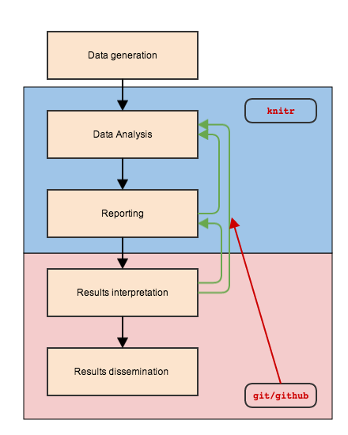

# Some Tools for Reproducible Research
Michael Sachs  
`r Sys.Date()`  


# At the lab?

\ 

# At the computer?

\ 
\ 
\ 
\ 


# Scientific Pathway

\ 


# Scientific Cycle

\ 

# Where do we fit in? 

\ 


# A framework for risk prediction

### Notation

- $S$ development dataset which includes, for each of $n$ represented individuals, 
    + a feature vector $X$, 
    + an outcome $Y$, 
    + a treatment $Z$, and possibly other variables. 
- $S$ is a sample of size $n$ from some distribution 
- $f \in \mathcal{F}$ denotes that $f$ is estimated with the class of methods $\mathcal{F}$. 
- Let $\phi: \mathcal{D} \times \mathcal{X} \mapsto \mathbb{R}$ denote the statistic that quantifies the performance of the function $f$


# Evaluating performance

- $\phi$ is a function of both $f$ and $S$. 
- Interested in estimating $E_\mathcal{P}[\phi_{f^*}(S)]$, for a particular $f^* \in \mathcal{F}$.
- One estimate is $\hat{E}[\phi_f(S)] = \frac{1}{n}\sum_{i=1}^n\phi_f(s_i)$.

However, if the $\mathcal{F}$ involves *interacting with $S$*, then the estimate will be biased.

# Examples of "interacts with $S$"

1. Working on a genomic classifier for binary $Y$:
    + I test it out on $S$, and take a look at the individual-level accuracys $\phi(s_i)$ of a classifier $f(x_i)$
    + For $i$ where $\phi(s_i)$ is poor, manually change the value of $y_i$. 
2. Developing a predictor for binary $Y$:
    + Test the association of each $X_j$ with $Y$ using t-test on $S$. 
    + Select the 50 most significant
    + Put them all in a regression model and test on $S$
3. Developing predictive signature
    + Split into $S_t$ and $S_h$
    + Build clustering model on $S_t$
    + Test performance on $S_h$
    + Performance isn't as good as I expected 
    + Go back to $S_t$ and try again using a different approach
    
**Which ones give valid estimates?**

All aspects of $\mathcal{F}$ should be documented and reported


# Tools to make our lives better

\ 


# Data analysis

\ 

Goals: 

- Avoid making arbitrary/data-driven decisions that go undocumented or unreported
- Avoid data manipulations that go undocumented or unreported


# Knitr

### Motivation

- Cut and paste for report production is not a viable method
    + tedious, slow, error-prone
- Incorporate analysis code into text documents
    + `knit` to create results
    + no extra steps to get desired output
    + post-process to get any type of output format
- Literate documents
    + Code creates results to inform report
    + Prose surrounding code informs analysis
    
# History

- Sweave has been around since 2002
    + Mix R code into Latex docs
    + Problems make it hard to use
    + Most people don't use Latex
- knitr 
    + aimed to solve those problems
    + agnostic about input and output formats
- rmarkdown
    + markdown emerged as a simple but powerful markup language
    + pandoc allows conversion to and from almost any format (even .docx)
    
# The importance of text

- Text is future-proof
    + No worries about `.doc` $\rightarrow$ `.docx`
    + Cross-platform
    + Useful tools exist to track line-by-line changes in text <div class="blue"> (git) </div>
- Our requirements
    + Text doc should stand on its own
    + Minimal, semantic markup 
    + Applies to code also
    
# Markdown

Plain-text formatting. Indicate what elements represent, not how they should look. Minimal, yet flexible, html and latex commands are interpreted correctly.

\ 

# Contrast with tex

\ 


# Markdown specs

- Paragraphs, `# headers, ## subheader, etc`, `> blockquotes`
- Emphasis, `_italics_, *italics*, __bold__, **bold**`
- Images/links: ``, `[text](link)`
- Lists/ordered lists `- > +`, `1. 2. 3.`
- Latex equations: `$\sum_{i=1}^nX_i/n$` = $\sum_{i=1}^nX_i/n$
- Citations: `[@citekey]`, bibtex, endnote, others supported


# Incorporating code chunks


Three backticks:


    ```{r my-first-chunk, results='asis'}
    ## code goes in here and gets evaluated
    ```

See http://yihui.name/knitr/options#chunk_options for all available options. 

Inline code uses single backticks

Here I am using `` `#r rnorm(1)` `` to generate a random digit: 0.6795769. (Omit the pound sign)

# Results, raw output {.smaller}

Raw output using the `mtcars` dataset:


    ```{r mtcars-example}
    summary(lm(mpg ~ hp + wt, data = mtcars))
    ```

```
## 
## Call:
## lm(formula = mpg ~ hp + wt, data = mtcars)
## 
## Residuals:
##    Min     1Q Median     3Q    Max 
## -3.941 -1.600 -0.182  1.050  5.854 
## 
## Coefficients:
##             Estimate Std. Error t value Pr(>|t|)    
## (Intercept) 37.22727    1.59879  23.285  < 2e-16 ***
## hp          -0.03177    0.00903  -3.519  0.00145 ** 
## wt          -3.87783    0.63273  -6.129 1.12e-06 ***
## ---
## Signif. codes:  0 '***' 0.001 '**' 0.01 '*' 0.05 '.' 0.1 ' ' 1
## 
## Residual standard error: 2.593 on 29 degrees of freedom
## Multiple R-squared:  0.8268,	Adjusted R-squared:  0.8148 
## F-statistic: 69.21 on 2 and 29 DF,  p-value: 9.109e-12
```

## Results, a table

Since markdown interprets html, we can use `kable` to generate html tables from `R`


```r
kable(head(mtcars))
```

                      mpg   cyl   disp    hp   drat      wt    qsec   vs   am   gear   carb
------------------  -----  ----  -----  ----  -----  ------  ------  ---  ---  -----  -----
Mazda RX4            21.0     6    160   110   3.90   2.620   16.46    0    1      4      4
Mazda RX4 Wag        21.0     6    160   110   3.90   2.875   17.02    0    1      4      4
Datsun 710           22.8     4    108    93   3.85   2.320   18.61    1    1      4      1
Hornet 4 Drive       21.4     6    258   110   3.08   3.215   19.44    1    0      3      1
Hornet Sportabout    18.7     8    360   175   3.15   3.440   17.02    0    0      3      2
Valiant              18.1     6    225   105   2.76   3.460   20.22    1    0      3      1

## Results, a plot


```r
library(ggplot2)
ggplot(mtcars, aes(y = mpg, x = wt, size = hp)) + 
  geom_point() + stat_smooth(method = "lm", se = FALSE)
```

<!-- -->

# Controlling `R` output

There are at least three functions I'm aware of that will help create output tables. 

- `kable` in the `knitr` package
    + simple table generator
    + markdown, html, or tex output
    + few options for customization
- `xtable` in the `xtable` package
    + many options for customization
    + html or tex output
    + clunky interface, some options go to `xtable()` others to `print.xtable()`
- `pandoc.table` in the `pander` package
    + many options for customization

# `kable` example


```r
kable(head(mtcars), digits = 2)
```

                      mpg   cyl   disp    hp   drat     wt    qsec   vs   am   gear   carb
------------------  -----  ----  -----  ----  -----  -----  ------  ---  ---  -----  -----
Mazda RX4            21.0     6    160   110   3.90   2.62   16.46    0    1      4      4
Mazda RX4 Wag        21.0     6    160   110   3.90   2.88   17.02    0    1      4      4
Datsun 710           22.8     4    108    93   3.85   2.32   18.61    1    1      4      1
Hornet 4 Drive       21.4     6    258   110   3.08   3.21   19.44    1    0      3      1
Hornet Sportabout    18.7     8    360   175   3.15   3.44   17.02    0    0      3      2
Valiant              18.1     6    225   105   2.76   3.46   20.22    1    0      3      1

# `xtable` example


```r
library(xtable)
print(xtable(head(mtcars)), type = "html")
```

<!-- html table generated in R 3.3.1 by xtable 1.8-2 package -->
<!-- Mon Sep 05 15:13:12 2016 -->
<table border=1>
<tr> <th>  </th> <th> mpg </th> <th> cyl </th> <th> disp </th> <th> hp </th> <th> drat </th> <th> wt </th> <th> qsec </th> <th> vs </th> <th> am </th> <th> gear </th> <th> carb </th>  </tr>
  <tr> <td align="right"> Mazda RX4 </td> <td align="right"> 21.00 </td> <td align="right"> 6.00 </td> <td align="right"> 160.00 </td> <td align="right"> 110.00 </td> <td align="right"> 3.90 </td> <td align="right"> 2.62 </td> <td align="right"> 16.46 </td> <td align="right"> 0.00 </td> <td align="right"> 1.00 </td> <td align="right"> 4.00 </td> <td align="right"> 4.00 </td> </tr>
  <tr> <td align="right"> Mazda RX4 Wag </td> <td align="right"> 21.00 </td> <td align="right"> 6.00 </td> <td align="right"> 160.00 </td> <td align="right"> 110.00 </td> <td align="right"> 3.90 </td> <td align="right"> 2.88 </td> <td align="right"> 17.02 </td> <td align="right"> 0.00 </td> <td align="right"> 1.00 </td> <td align="right"> 4.00 </td> <td align="right"> 4.00 </td> </tr>
  <tr> <td align="right"> Datsun 710 </td> <td align="right"> 22.80 </td> <td align="right"> 4.00 </td> <td align="right"> 108.00 </td> <td align="right"> 93.00 </td> <td align="right"> 3.85 </td> <td align="right"> 2.32 </td> <td align="right"> 18.61 </td> <td align="right"> 1.00 </td> <td align="right"> 1.00 </td> <td align="right"> 4.00 </td> <td align="right"> 1.00 </td> </tr>
  <tr> <td align="right"> Hornet 4 Drive </td> <td align="right"> 21.40 </td> <td align="right"> 6.00 </td> <td align="right"> 258.00 </td> <td align="right"> 110.00 </td> <td align="right"> 3.08 </td> <td align="right"> 3.21 </td> <td align="right"> 19.44 </td> <td align="right"> 1.00 </td> <td align="right"> 0.00 </td> <td align="right"> 3.00 </td> <td align="right"> 1.00 </td> </tr>
  <tr> <td align="right"> Hornet Sportabout </td> <td align="right"> 18.70 </td> <td align="right"> 8.00 </td> <td align="right"> 360.00 </td> <td align="right"> 175.00 </td> <td align="right"> 3.15 </td> <td align="right"> 3.44 </td> <td align="right"> 17.02 </td> <td align="right"> 0.00 </td> <td align="right"> 0.00 </td> <td align="right"> 3.00 </td> <td align="right"> 2.00 </td> </tr>
  <tr> <td align="right"> Valiant </td> <td align="right"> 18.10 </td> <td align="right"> 6.00 </td> <td align="right"> 225.00 </td> <td align="right"> 105.00 </td> <td align="right"> 2.76 </td> <td align="right"> 3.46 </td> <td align="right"> 20.22 </td> <td align="right"> 1.00 </td> <td align="right"> 0.00 </td> <td align="right"> 3.00 </td> <td align="right"> 1.00 </td> </tr>
   </table>

# `pandoc.table` example


```r
library(pander)
pandoc.table(head(mtcars))
```


-----------------------------------------------------------------------------
        &nbsp;           mpg   cyl   disp   hp   drat   wt    qsec   vs   am 
----------------------- ----- ----- ------ ---- ------ ----- ------ ---- ----
     **Mazda RX4**       21     6    160   110   3.9   2.62  16.46   0    1  

   **Mazda RX4 Wag**     21     6    160   110   3.9   2.875 17.02   0    1  

    **Datsun 710**      22.8    4    108    93   3.85  2.32  18.61   1    1  

  **Hornet 4 Drive**    21.4    6    258   110   3.08  3.215 19.44   1    0  

 **Hornet Sportabout**  18.7    8    360   175   3.15  3.44  17.02   0    0  

      **Valiant**       18.1    6    225   105   2.76  3.46  20.22   1    0  
-----------------------------------------------------------------------------

Table: Table continues below

 
-------------------------------------
        &nbsp;           gear   carb 
----------------------- ------ ------
     **Mazda RX4**        4      4   

   **Mazda RX4 Wag**      4      4   

    **Datsun 710**        4      1   

  **Hornet 4 Drive**      3      1   

 **Hornet Sportabout**    3      2   

      **Valiant**         3      1   
-------------------------------------


# inline results {.smaller}

Generate every in-text number from code. 

`paste` and `sprintf` are my friends. 


```r
paste_meansd <- function(x, digits = 2, na.rm = TRUE){
  paste0(round(mean(x, na.rm = na.rm), digits), 
         " (", round(sd(x, na.rm = na.rm), digits), ")")  
}

## The mean (sd) of a random sample of normals is `r paste_meansd(rnorm(100))`
```

The mean (sd) of a random sample of normals is 0.11 (1.08)


```r
sprint_CI95 <- function(mu, se) {
  lim <- mu + c(-1.96, 1.96) * se
  ### <b>
  sprintf("%.2f (95%% CI: %.2f to %.2f)", mu, lim[1], lim[2])
  ### </b>
}
bfit <- lm(hp ~ disp, mtcars)
## The coefficient estimate is `r sprint_CI95(bfit$coeff[2], sqrt(diag(vcov(bfit)))[2])`
```
The coefficient estimate is 0.44 (95% CI: 0.32 to 0.56).


# Figure options

The important ones:

- `dev`, graphics device. E.g. pdf, png, check out `tikzDevice` if you are creating pdf output: 
    + http://bit.ly/114GNdP
- `path` where to save the plot files
- `fig_width`, `fig_height`, `fig_asp` in inches. Can also be set globally.
- `fig_align`, left, right or center


# Other options

- `include = FALSE` evaluates code but doesn't include anything
- `echo = FALSE` don't display results
- `warning = FALSE` don't display warnings
- `cache = TRUE` cache results for long-running stuff
- `code = readLines('external-script.R')`

# Front matter

Global options set at start of document. 
 
- Document types
    + `pdf_document`, `word_document`, `html_document`
    + `beamer_presentation`, `ioslides_presentation`, `slidy_presentation`
- Other options
    + `bibliography: mybib.bib`
    + Cite with `@paperkey`
    + See http://rmarkdown.rstudio.com/ for complete documentation

```
---
title: "Some Tools for Reproducible Research"
author: "Michael Sachs"
date: "2016-09-05"
output: slidy_presentation
---
```

# Getting started

+ Packages: 
    - knitr
    - rmarkdown
+ Commands: 
    - `render('doc.Rmd')` format specified in front matter
    - `render('doc.Rmd', format = 'word_document')`
    - Buttons if you use Rstudio
+ Other details:
    - Remember R  commands are run sequentially in a session started in the directory where the .Rmd file is saved
    - Use relative paths (e.g. "../Data/file.csv" and not "C:/Home/Data/file.csv")
    - Never `setwd()`!
+ Templates: 
    - [Biostat Core Report](https://raw.githubusercontent.com/sachsmc/MCmisc/master/inst/rmarkdown/templates/kiconsult/skeleton/skeleton.Rmd)
    - [rticles](https://github.com/rstudio/rticles)
    - [Statistics Journals](https://github.com/sachsmc/pandoc-journal-templates)

# Limitations

- Markdown is simple
    + Can't precisely control everything in output
    + How much control do you need? 
- R $\rightarrow$ .docx works great
    + R $\nleftarrow$ .docx
    + Incorporating changes and collaborating with clinicians
- Still requires good coding and project organization practices
- Can't prevent fraud
    + Can: help make open data and open code part of our social norms

# References

1. _The Economist_ 'Trouble at the Lab' 2013 Oct 19; available at http://go.nature.com/dstij3.
2. Baggerly, Keith A., and Kevin R. Coombes. "Deriving chemosensitivity from cell lines: Forensic bioinformatics and reproducible research in high-throughput biology." _The Annals of Applied Statistics_ (2009): 1309-1334.
3. Witten, Daniela M., and Robert Tibshirani. "Scientific research in the age of omics: the good, the bad, and the sloppy." _Journal of the American Medical Informatics Association_ 20(1) (2013): 125-127.
4. Ziemann, Mark, Yotam Eren, and Assam El-Osta. "Gene name errors are widespread in the scientific literature." _Genome Biology_ 17(1) (2016): 177.
5. Eklund, Anders, Thomas E. Nichols, and Hans Knutsson. "Cluster failure: Why fMRI inferences for spatial extent have inflated false-positive rates." _Proceedings of the National Academy of Sciences_ (2016): 201602413.
6. Leisch, Friedrich. "Sweave: Dynamic generation of statistical reports using literate data analysis." In _Compstat_, pp. 575-580. Physica-Verlag HD, 2002.
7. Xie, Yihui. _Dynamic Documents with R and knitr_. Vol. 29. CRC Press, 2015.
8. Sachs, Michael C., and Lisa M. McShane. "Issues in developing multivariable molecular signatures for guiding clinical care decisions." _Journal of Biopharmaceutical Statistics_ just-accepted (2016).
9. Rmarkdown, Rstudio. https://rmarkdown.rstudio.com
10. Wilson, Greg, Bryan, Jennifer, Cranston, Karen, et al. "Good Enough Practices in Scientific Computing" (2016). https://arxiv.org/pdf/1609.00037v1.pdf


Source for this talk available at http://github.com/sachsmc/bcore-talk-160906


